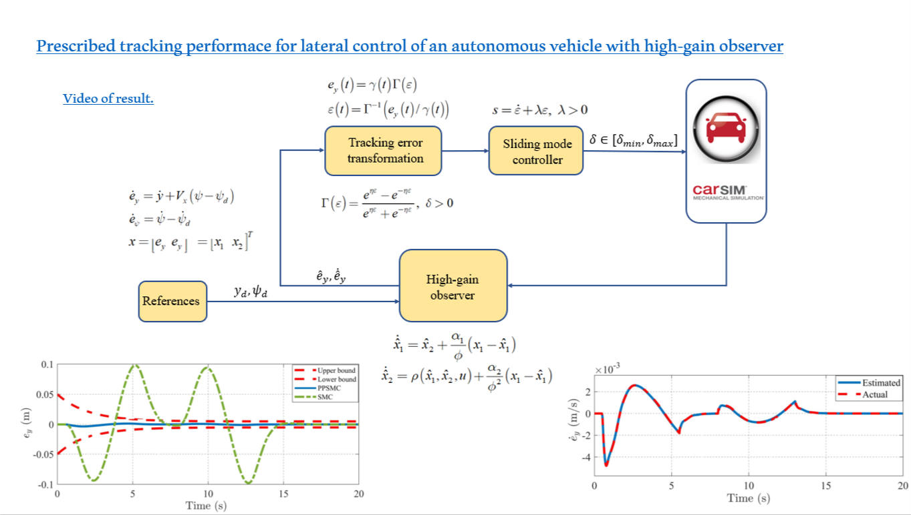

# car_psmc_matlab

## Introduction

This resource offers the implementation of a Prescribed Performance Sliding Mode Controller for controlling autonomous vehicles during a double lane changing maneuver, as presented in our paper ["Prescribed Tracking Performace for Lateral Control of an Autonomous Vehicle with High-Gain Observer"](10.1109/ICCAIS56082.2022.9990307).
The simulation is carried out using MATLAB/Simulink and Carsim 2017. 

## Results

